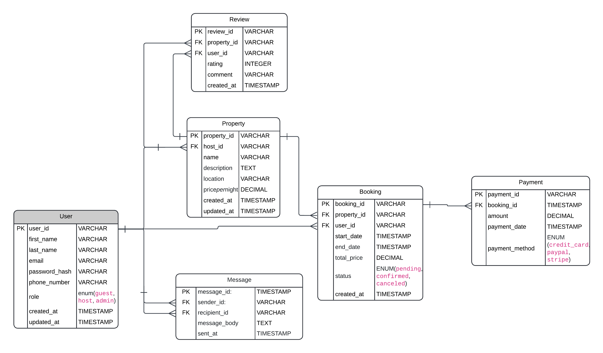

# Airbnb Database Requirements

## 1. Overview

This document defines the database requirements for an Airbnb-style platform that allows users to list properties, book stays, leave reviews, make payments, and send messages. The ER diagram visually represents the relationships between these core entities.

---

## 2. ER Diagram

Below is the ER diagram for the database design:

---

## 3. Entities and Attributes

### User

- user_id (PK, UUID, Indexed)
- first_name (VARCHAR, NOT NULL)
- last_name (VARCHAR, NOT NULL)
- email (VARCHAR, UNIQUE, NOT NULL)
- password_hash (VARCHAR, NOT NULL)
- phone_number (VARCHAR, NULL)
- role (ENUM: guest, host, admin, NOT NULL)
- created_at (TIMESTAMP, DEFAULT CURRENT_TIMESTAMP)

### Property

- property_id (PK, UUID, Indexed)
- host_id (FK → User.user_id)
- name (VARCHAR, NOT NULL)
- description (TEXT, NOT NULL)
- location (VARCHAR, NOT NULL)
- pricepernight (DECIMAL, NOT NULL)
- created_at (TIMESTAMP, DEFAULT CURRENT_TIMESTAMP)
- updated_at (TIMESTAMP, ON UPDATE CURRENT_TIMESTAMP)

### Booking

- booking_id (PK, UUID, Indexed)
- property_id (FK → Property.property_id)
- user_id (FK → User.user_id)
- start_date (DATE, NOT NULL)
- end_date (DATE, NOT NULL)
- total_price (DECIMAL, NOT NULL)
- status (ENUM: pending, confirmed, canceled, NOT NULL)
- created_at (TIMESTAMP, DEFAULT CURRENT_TIMESTAMP)

### Payment

- payment_id (PK, UUID, Indexed)
- booking_id (FK → Booking.booking_id)
- amount (DECIMAL, NOT NULL)
- payment_date (TIMESTAMP, DEFAULT CURRENT_TIMESTAMP)
- payment_method (ENUM: credit_card, paypal, stripe, NOT NULL)

### Review

- review_id (PK, UUID, Indexed)
- property_id (FK → Property.property_id)
- user_id (FK → User.user_id)
- rating (INTEGER, CHECK rating BETWEEN 1 AND 5, NOT NULL)
- comment (TEXT, NOT NULL)
- created_at (TIMESTAMP, DEFAULT CURRENT_TIMESTAMP)

### Message

- message_id (PK, UUID, Indexed)
- sender_id (FK → User.user_id)
- recipient_id (FK → User.user_id)
- message_body (TEXT, NOT NULL)
- sent_at (TIMESTAMP, DEFAULT CURRENT_TIMESTAMP)

---

## 4. Relationships

| Relationship        | Cardinality                      |
| ------------------- | -------------------------------- |
| User to Property    | 1 to Many                        |
| User to Booking     | 1 to Many                        |
| Property to Booking | 1 to Many                        |
| Booking to Payment  | 1 to 1                           |
| Property to Review  | 1 to Many                        |
| User to Review      | 1 to Many                        |
| User to Message     | Many to Many (via Message table) |

---

## 5. Business Rules and Assumptions

- A user can act as both guest and host.
- Reviews only allowed after completed bookings.
- Payments only made for confirmed bookings.
- Booking status lifecycle is enforced.
- Messages always have valid sender and recipient.

---

## 6. Constraints and Data Integrity

### User

- Email must be unique.
- Required fields enforce valid registration.

### Property

- Host must be a valid registered user.

### Booking

- Valid user and property references required.
- Status limited to valid enum options.

### Payment

- Must reference an existing booking.

### Review

- Rating restricted between 1–5 inclusive.

### Message

- Sender and recipient must be registered users.

---

## 7. Indexing

| Table    | Index                   |
| -------- | ----------------------- |
| User     | email, user_id          |
| Property | property_id             |
| Booking  | booking_id, property_id |
| Payment  | booking_id              |
| Review   | review_id               |
| Message  | message_id              |

---

## Version

Last Updated: October 2025
